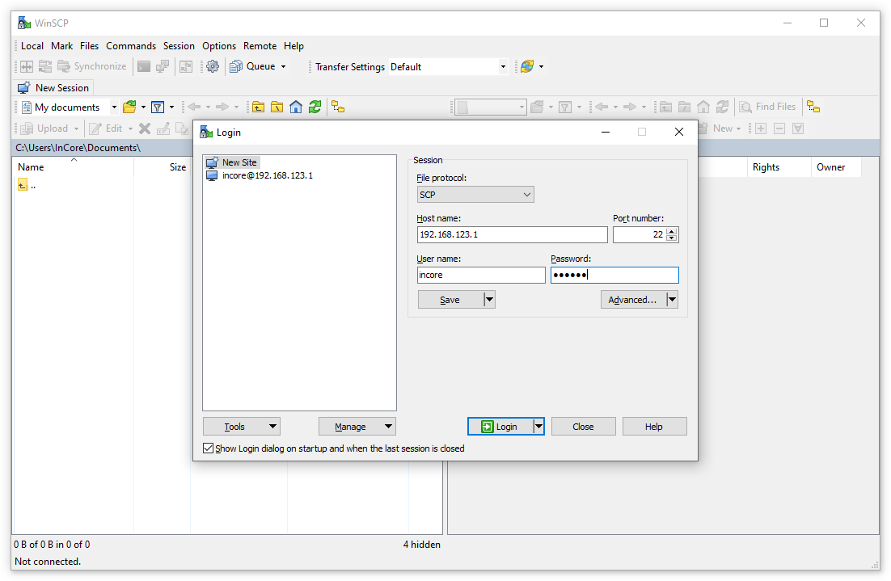

.. _AccessingAppData:

Accessing application data
==========================

Objects such as :ref:`File <object_File>` together with :ref:`LocalStorage <object_LocalStorage>`, :ref:`LocalDatabase <object_LocalDatabase>`, :ref:`Configuration <object_Configuration>` or :ref:`Settings <object_Settings>` store their data on an internal storage partition of the HUB-GM100. The path depends on the :ref:`Application.name <property_Application_name>` property, i.e. all files are stored in the :file:`/storage/incore/<APPLICATION NAME>/` directory. If :ref:`Application.name <property_Application_name>` is not set, ``DefaultApp`` is used, so you'll find all files in the :file:`/storage/incore/DefaultApp/` directory.

To examine the files on the console, log in via PuTTY and navigate to the corresponding directory via ``cd``. Now you can inspect the files using appropriate Linux tools such as ``view``, ``head``/``tail`` or ``grep``. See `10 command-line tools for data analysis in Linux <https://opensource.com/article/17/2/command-line-tools-data-analysis-linux>`_ for more information.

The files in question can also be transferred to your local computer using the Secure Copy Protocol (SCP). For this purpose, the SSH service must first be started, e.g. by :ref:`putting the device into development mode <DevelopmentMode>`. On Linux you can then use ``scp`` to copy the files:

.. code-block:: none

    scp incore@192.168.123.1:/storage/incore/<APPLICATION NAME>/* .

On Windows download, install and run `WinSCP <https://winscp.net/eng/index.php>`_. In the :guilabel:`Login` dialog

* change the :guilabel:`File protocol` to :guilabel:`SCP`
* enter ``192.168.123.1`` (or the corresponding IP address of the device in your LAN) into the :guilabel:`Host name` field
* set both the username to ``incore`` and the password to ``incore``

Press :guilabel:`Save` to remember the settings for the next session. Now log in using the :guilabel:`Login` button (:numref:`WinScpLogin`).

.. _WinScpLogin:

    Logging in with WinSCP

In the appearing dialog window confirm the server's host key initially by pressing :guilabel:`Yes`. Now you can navigate to the directory :file:`/storage/incore` and access your files. Files can be copied by pressing :kbd:`F5` (:numref:`WinScpCopyFile`) and removed by pressing :kbd:`Del`.

.. _WinScpCopyFile:

    Copy files to local computer via WinSCP

