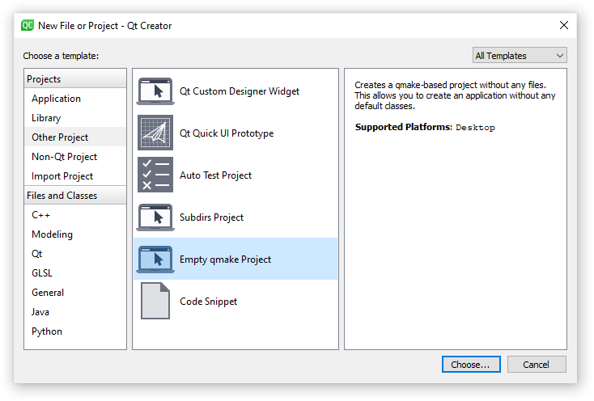
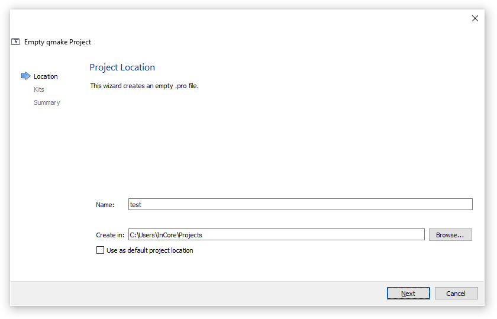
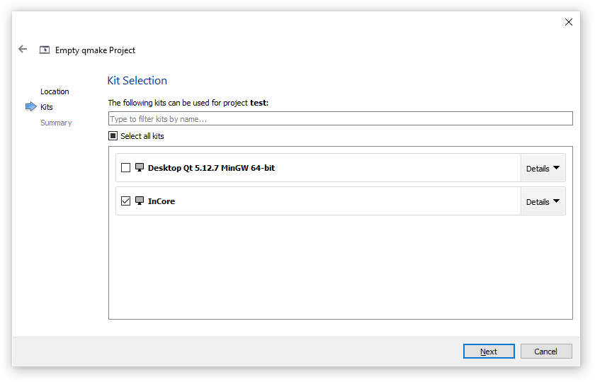
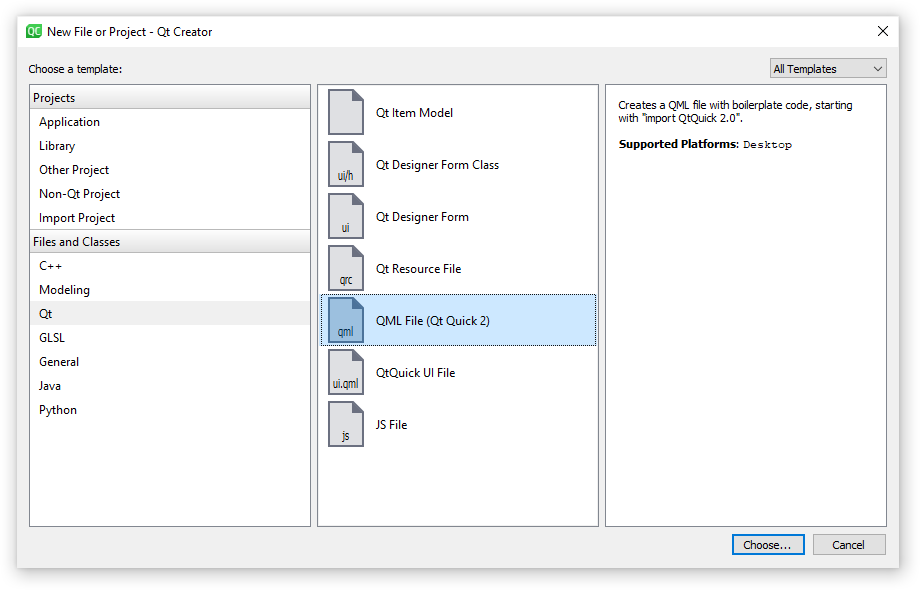
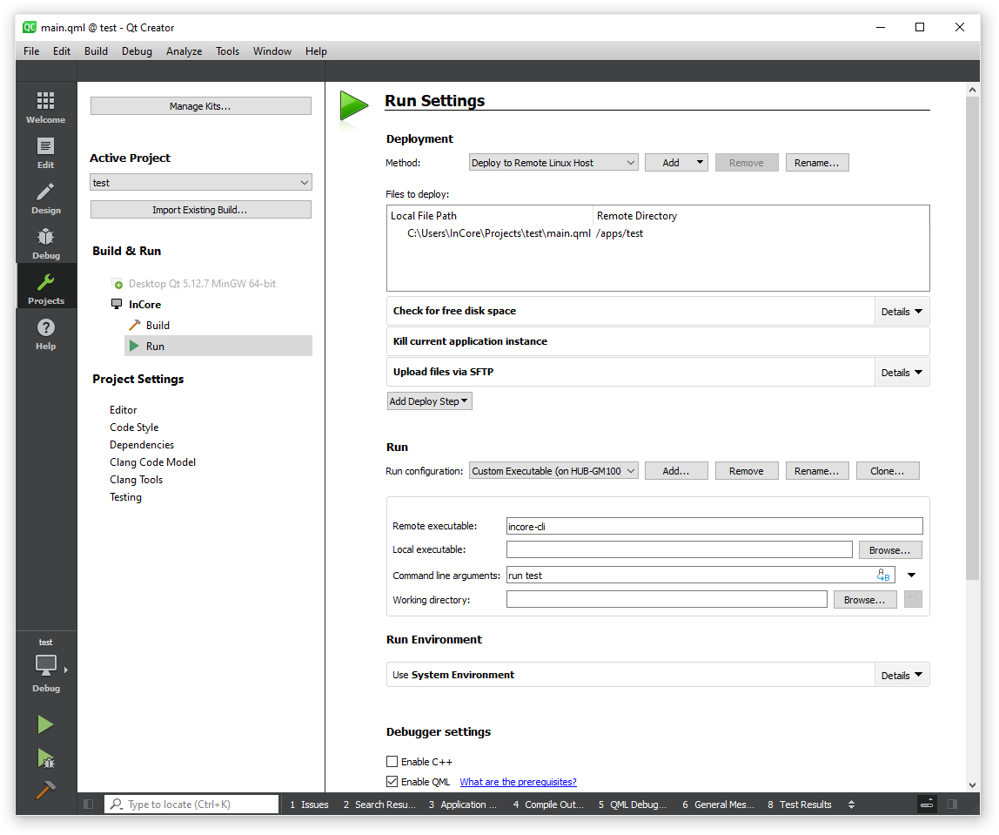
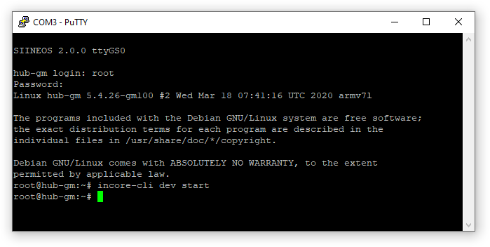
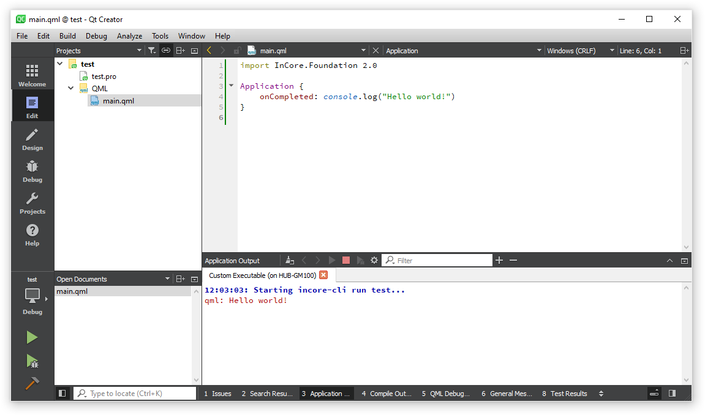

Creating, deploying and running applications
============================================

Creating an example application
-------------------------------

After performing the necessary installation and configuration steps as described in the :ref:`InCore Install Guide <InCoreInstallGuide>`, you can now start the application development.

First start Qt Creator, open the :guilabel:`File` menu and select :guilabel:`New File or Project`. In the appearing dialog box select :guilabel:`Other Project` from the left handed menu and the :guilabel:`Empty qmake Project` template (:numref:`QtCreatorNewProject`).

.. _QtCreatorNewProject:

    Creating a new project in Qt Creator

In the appearing dialog box (:numref:`QtCreatorProjectNameAndLocation`), give your project the name ``test`` and choose its location.

.. _QtCreatorProjectNameAndLocation:

    Setting project name and location in Qt Creator

On the next page please select the kit you've created in one of the steps described in the :ref:`InCore Install Guide <SettingUpQtCreator>` (:numref:`QtCreatorKitSelection`). Please press :guilabel:`Finish` on the next page.

.. _QtCreatorKitSelection:

    Selecting kit for new project in Qt Creator

Now the project is created and Qt Creator should automatically open the project file :file:`test.pro`. Replace all existing lines with the following and save it:

.. code-block:: none

    CONFIG = incore_app
    TARGET = test

Now please add a new file to the project via the menu :guilabel:`File` → :guilabel:`New File or Project` and select :guilabel:`Qt` → :guilabel:`QML File` in the appearing dialog box (:numref:`QtCreatorNewQmlFile`). Give it the name ``main.qml``, press :guilabel:`Next` and :guilabel:`Finish` afterwards.

.. _QtCreatorNewQmlFile:

    Creating a new QML file in Qt Creator

Qt Creator automatically opens the new file :file:`main.qml` in the text editor. Please remove the example code lines since they are not required for InCore apps.

Every InCore app has to import the InCore modules it wants to use. The basic module which is always required is called ``Foundation``. To import it add the following line to :file:`main.qml`:

.. code-block:: qml

    import InCore.Foundation 2.0

An application should use :ref:`Application <object_Application>` as its root object:

.. code-block:: qml

    Application {
    }

Of course we want to start with a classic, so the final :file:`main.qml` should look like this:

.. code-block:: qml

    import InCore.Foundation 2.0

    Application {
        onCompleted: console.log("Hello world!")
    }

In the next section this example application will be deployed and run on a HUB-GM100.

Deploying and running an application
------------------------------------

In order to deploy the app to a HUB-GM100, the *Run Settings* of your project have to be configured accordingly. Choose :guilabel:`Projects` from the left handed menu and edit the :guilabel:`Run Settings` as shown in :numref:`QtCreatorRunSettings`:

1) If not already selected, change the deployment method to :guilabel:`Remote Linux Host` or add a new deployment method,
2) Change the *Run configuration* to :guilabel:`Custom Executable (on HUB-GM100)`,
3) Change the *Remote executable* to ``incore-cli``,
4) Change the *Command line arguments* to ``run test``.

.. _QtCreatorRunSettings:

    Settings for running InCore apps on a HUB-GM100

.. _DevelopmentMode:

Before the application can be deployed and started, the device needs to be put into development mode. In this mode the storage for apps is made writable, all running apps are stopped and the SSH service is being started. To activate development mode, start a PuTTY session and log in as described in section `Logging in <https://siineos.readthedocs.io/en/latest/first-use.html#logging-in>`_ in the `SIINEOS Manual <https://siineos.readthedocs.io/>`_. After logging in enter the command ``incore-cli dev start`` (:numref:`InCoreCliDevStart`).

The development mode can later be stopped again via ``incore-cli dev stop`` or by rebooting the device.

.. important:: The development mode is only activated temporarily. Once the device is rebooted or powered off, the device starts in regular non-development mode again.

.. _InCoreCliDevStart:

    Starting development mode on a HUB-GM100

Now switch back to the editor window of the Qt Creator. The application can now be run by clicking :guilabel:`Build` → :guilabel:`Run` from the main menu or using the shortcut :kbd:`Ctrl+R` or by pressing the green play button in the left handed menu.

If all steps have been followed properly, the application will be started and print its output to the IDE as shown in :numref:`InCoreCliRunHelloWorld`.

.. _InCoreCliRunHelloWorld:

    Output of the test application running on a HUB-GM100

.. note:: Whenever an application is deployed, it is stored permanently in the :file:`/apps/<APPNAME>` directory. It will be started automatically on every start of the HUB-GM100. In general when SIINEOS boots, it creates an application instance for every subdirectory inside :file:`/apps` containing a file called :file:`main.qml`.

Congratulations, you’ve successfully deployed and started your first application on a HUB-GM100! Now you can start playing with the HUB-GM100 and continue with the :ref:`InCore tutorials <Tutorials>`.
