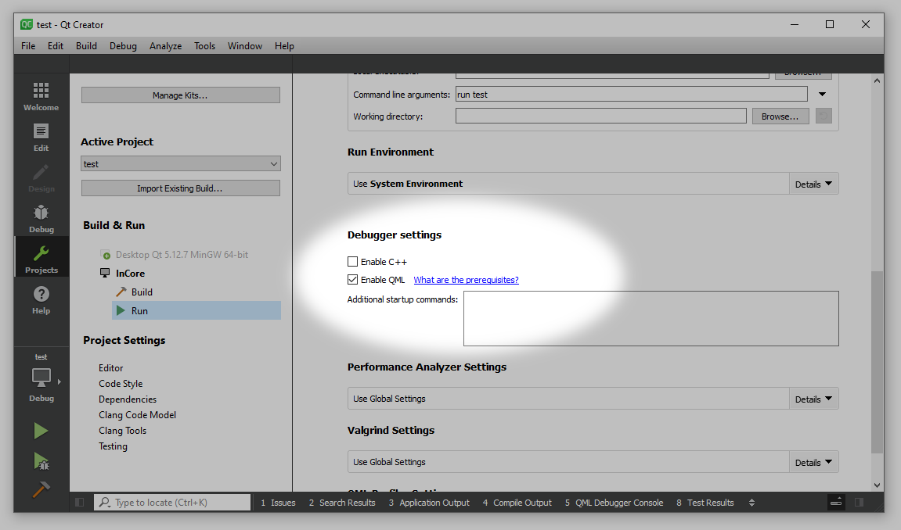
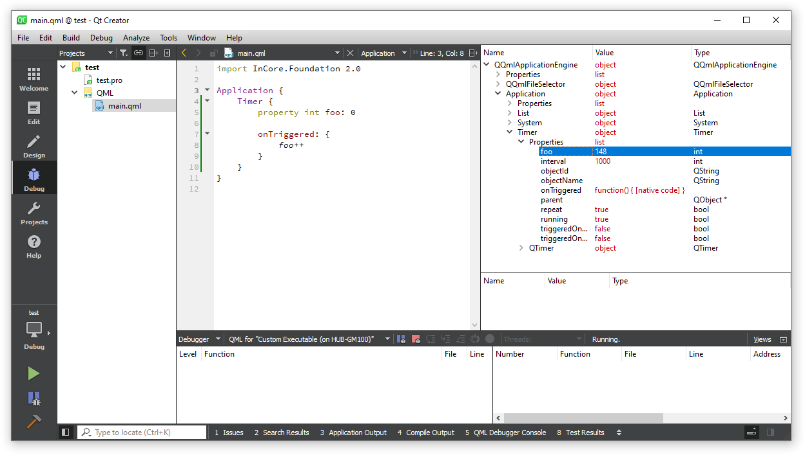
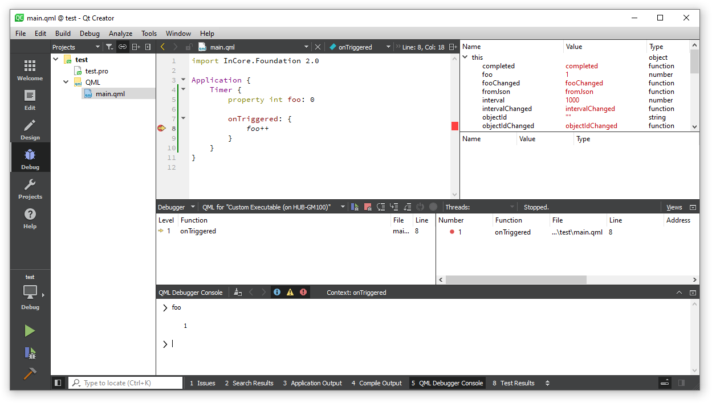

Debugging applications
======================

QML debugging
-------------

InCore apps can be debugged easily using the builtin QML debugger in Qt Creator. Before starting, the debugger settings have to be adjusted. Open the :guilabel:`Run Settings` of your project, scroll down to the :guilabel:`Debugger settings` and ensure :guilabel:`Enable C++` is not checked whereas :guilabel:`Enable QML` is (:numref:`QtCreatorDebugSettings`).

.. _QtCreatorDebugSettings:

    Settings for debugging InCore apps on a HUB-GM100

Type the example code implementing a simple timer which increments a variable every second:

.. code-block:: qml

    import InCore.Foundation 2.0

    Application {
        Timer {
            property int foo: 0

            onTriggered: {
                foo++
            }
        }
    }

Now start debugging by clicking the green debug button in the left handed menu or by pressing :kbd:`F5`. The program will start running and you can inspect all properties in realtime through the :guilabel:`Locals` view on the right side. Expand ``Application``, ``Timer`` and ``Properties`` to see ``foo`` being incremented every second (:numref:`QtCreatorAppDebugging`).

.. _QtCreatorAppDebugging:

    Debugging an InCore app on a HUB-GM100

Next set a breakpoint at the code line that increments ``foo`` (click left to the line number). This will make the program being interrupted whenever this code line is executed (:numref:`QtCreatorBreakpoint`). You can inspect and even modify the properties of the local object (and navigate through the object hierarchy via the ``parent`` property). For example you can change the ``interval`` property and observe an appropriate behaviour change.

.. _QtCreatorBreakpoint:

    Program execution interrupted at a breakpoint

Further information on debugging QML applications can be found in the `Qt Creator Manual <https://doc.qt.io/qtcreator/creator-debugging-qml.html#debugging-javascript-functions>`_ (ignore the parts specific to QML user interfaces).

.. _InCoreDebugging:

InCore debugging
----------------

All InCore modules provide additional debug messages which can be enabled easily by setting the :ref:`Application.debug <property_Application_debug>` property to ``true``. When enabled, extra messages will be logged to the console, especially all error codes and strings whenever an error occurs in any object (which saves adding an ``onErrorOccurred`` handler to every object). Some additional messages also indicate code locations or invalid values causing the actual errors.

To debug applications without modifying them, you can alternatively set the :envvar:`INCORE_DEBUG` environment variable prior to executing ``incore-cli run ...``. Set the variable either at the command line when running ``incore-cli`` manually anyway or modify the project's :guilabel:`Run Environment` and add the corresponding environment variable.

To further increase the verbosity level, internal InCore function calls can be traced. This can be enabled by setting the :ref:`Application.trace <property_Application_trace>` property to ``true`` or setting the :envvar:`INCORE_TRACE` environment variable. When tracing is enabled, your console will likely be flooded with messages unless your application is very small or static. Consider setting a log message filter as described in section :ref:`MessageLoggingCustomization`.

.. _MessageLoggingCustomization:

Customizing message logging
---------------------------

In order to customize the format of log messages or add meta data fields such as a formatted time you can either modify the :ref:`Application.messageLoggingPattern <property_Application_messageLoggingPattern>` property or set the :envvar:`QT_MESSAGE_PATTERN` environment variable accordingly (see section :ref:`InCoreDebugging` on how to do this in Qt Creator). See the `Qt documentation on message patterns <https://doc.qt.io/qt-5/qtglobal.html#qSetMessagePattern>`_ for details and all supported placeholders.

To filter messages you can set the :ref:`Application.messageLoggingFilterRules <property_Application_messageLoggingFilterRules>` property or set the :envvar:`QT_LOGGING_RULES` environment variable. See the property documentation for details on syntax and supported values.
