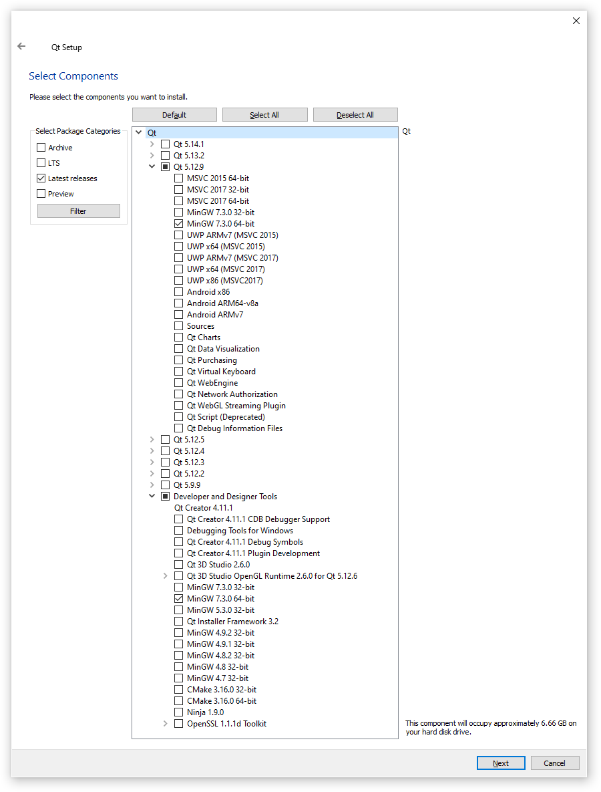
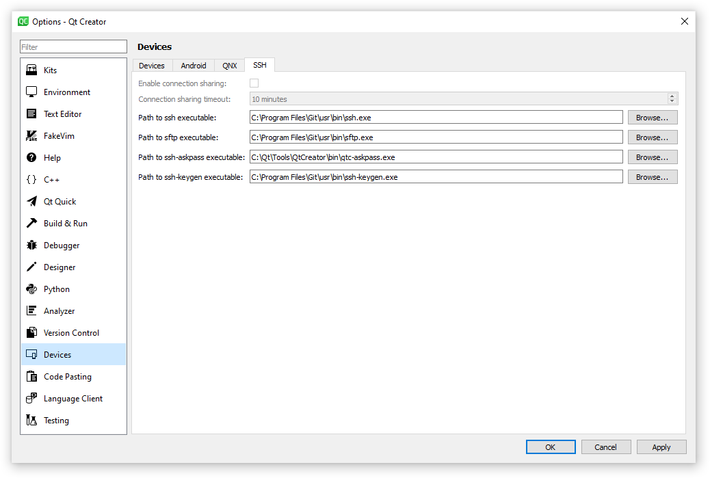
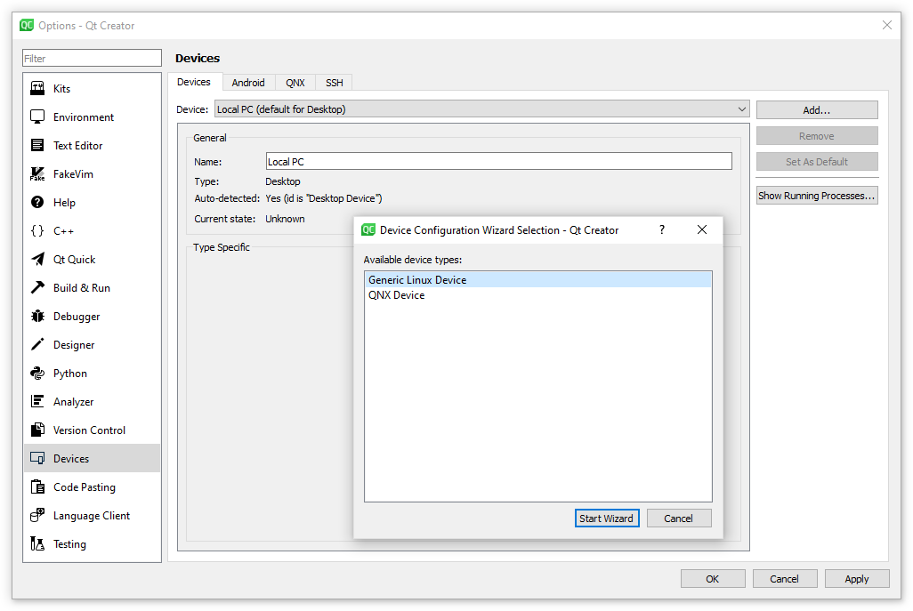
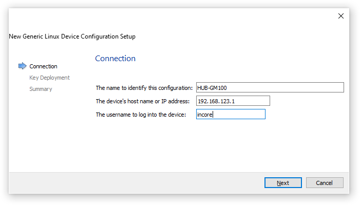
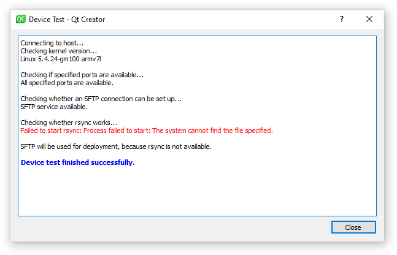
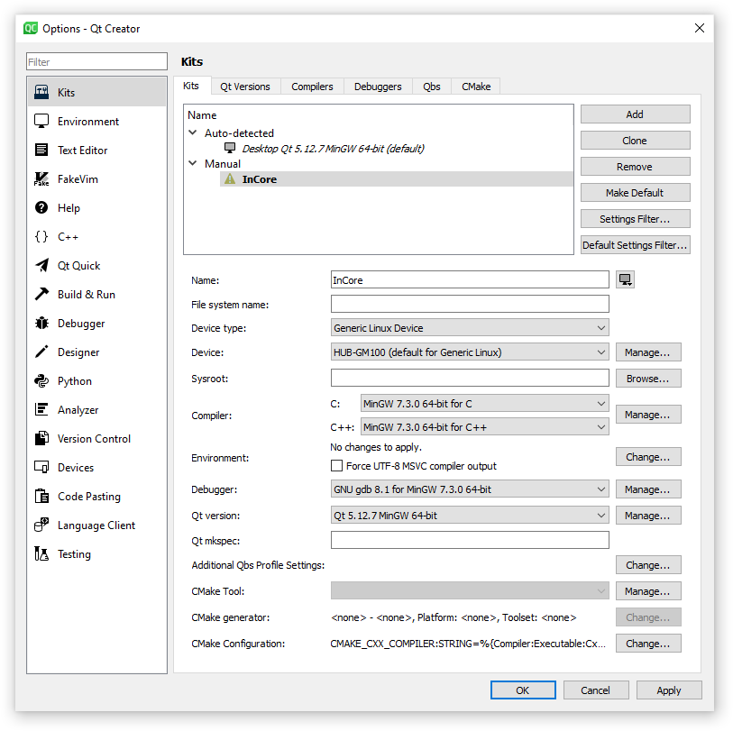

.. _SettingUpQtCreator:

Setting up Qt Creator
=====================

Qt Creator is a cross-platform IDE available for different operating systems (Windows 7 or later, Linux32, Linux64, macOS 10.12 or later). The easiest way to get the IDE is to download and install Qt 5 that contains the Qt libraries, examples, documentation, and the necessary development tools.

If you already have Qt installed on your system, please ensure to use at least Qt Creator 4.9.1 due to bugs regarding software deployment via SFTP to remote linux devices in earlier versions. Otherwise please download the online installer as linked in section :ref:`Qt`, execute it and install the MinGW 7.3.0 32 or 64 bit versions of Qt 5.12.9 or newer (don't check the whole Qt 5.x.y item but select the mentioned MinGW version only) as well as the MinGW 7.3.0 32 or 64 bit component of the Developer and Designer Tools. See :numref:`QtInstallation` for details.

.. _QtInstallation:

	Selecting components during Qt installation

After the installation has completed, download and install the latest version of the *InCore Framework SDK*. All InCore-related downloads are available at our downloads servers as linked in section :ref:`InCoreSDK`.

Now that all required software components are installed, the development environment needs to be set up and configured. After starting Qt Creator, first open the :guilabel:`Tools` dropdown menu and select the :guilabel:`Options` item which will bring up the options dialog. Choose :guilabel:`Devices` from the left handed menu and select the tab :guilabel:`SSH`. The dialog shown in :numref:`QtCreatorOptionsDevicesSSH` will appear. Now check the given paths to SSH-related executables and correct them if necessary.

.. _QtCreatorOptionsDevicesSSH:

	Setting up SSH in Qt Creator options dialog

Then go back to the :guilabel:`Devices` tab and press the :guilabel:`Add` button on the right to add some new Generic Linux Device. Press :guilabel:`Start Wizard` in the appearing dialog box (:numref:`QtCreatorOptionsAddDevice`).

.. _QtCreatorOptionsAddDevice:

	Adding a new Generic Linux Device

Now you have to configure the connection to the HUB-GM100 using the parameters shown in :numref:`QtCreatorNewDeviceConnection`

.. _QtCreatorNewDeviceConnection:

	Configuring connection parameters for HUB-GM100

Press :guilabel:`Next` to switch to the :guilabel:`Key Deployment` page. Press the :guilabel:`Browse` button to navigate to the SSH key you’ve created before (see chapter :ref:`SSH`). Choose the private key file (by default id_rsa) and press :guilabel:`Deploy Public Key` afterwards. In case you are asked for a password, type ``incore``.

.. note:: Credentials for file transfer via SFTP are: username ``incore`` / password ``incore``.

.. important:: Make sure the SSH service has been started before via the terminal connection as described in section `Logging in <https://siineos.readthedocs.io/en/latest/first-use.html#logging-in>`_ in the `SIINEOS Manual <https://siineos.readthedocs.io/>`_. Otherwise no connection can be established and an error message appears as the public key cannot be deployed to the HUB-GM100.

Press :guilabel:`Next` and :guilabel:`Finish` afterwards. The new device configuration will then be created and the connection to the device will be tested (:numref:`QtCreatorDeviceTest`). Please don’t bother with the output that rsync could not be started since this feature is not required for working with the InCore SDK.

.. _QtCreatorDeviceTest:

	Output of the Device Test

After being back in the :guilabel:`Options` dialog, please choose :guilabel:`Kits` from the left handed menu. In the appearing :guilabel:`Kits` page please select the auto detected desktop kit (in the tab :guilabel:`Kits`), and press :guilabel:`Clone`. Give the new kit a name (e.g. *InCore*), select :guilabel:`Generic Linux Device` as device type and select the device created in the step before. See :numref:`QtCreatorKitSetup` for reference. Apply all your changes and close the :guilabel:`Options` dialog.

.. _QtCreatorKitSetup:

	Setting up a custom kit with HUB-GM100 device

Congratulations, you’ve successfully configured Qt Creator for further app development with a HUB-GM100 gateway!

.. attention:: You'll likely encounter problems in case you are using more than one HUB-GM100 for app development with the same computer and Qt Creator since the virtual USB network IP address is the same for all HUB-GM100 devices but the SSH host keys differ. In such cases *SSH Host key errors* appear and you'll be warned about a possible man-in-the-middle attack or something similar when switching to another HUB-GM100. If that happens, please navigate to the folder where your SSH key is stored (by default :file:`.ssh` in your user directory) and delete the file :file:`known_hosts`. Afterwards everything should work as usual. Everytime you connect to another HUB-GM100 device the procedure needs to be repeated. To avoid these inconveniences consider connecting to all HUB-GM100 devices via Ethernet instead of USB and using unambiguous IP addresses.
