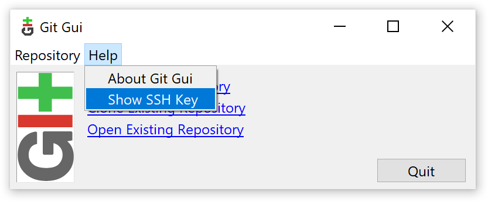
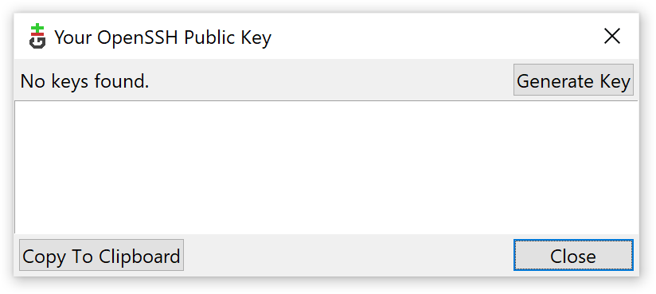

.. _SSH:

Installing and configuring SSH
==============================

In order to enable the IDE to establish secure connections to the HUB-GM100 (e.g. for transferring files or starting and debugging apps), you need to install an SSH client and create an SSH key pair first. On Windows the required OpenSSH tools are bundled with Git, a version control system to track changes in source code and other files. Please find the website and download links in section :ref:`Git`.

After installing Git, please start the Git GUI through the start menu, click the :guilabel:`Help` menu entry, and choose :guilabel:`Show SSH Key` in the dropdown menu as shown in :numref:`GitGUI`.

.. _GitGUI:

	Git GUI

If the appearing dialog box indicates :guilabel:`No keys found`, please press the :guilabel:`Generate Key` button (:numref:`GenerateSshKey`). Two dialogs will be shown asking you for a passphrase for the key. You can use an empty passphrase resp. no passphrase in that particular case. Once your key is generated you can close Git GUI. The key will be deployed to the HUB-GM100 in a later step.

.. _GenerateSshKey:

	Generate SSH Key

