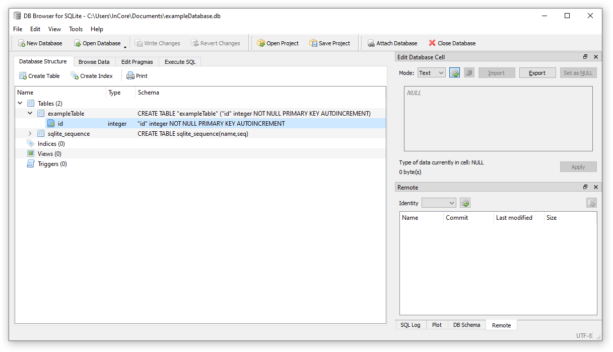
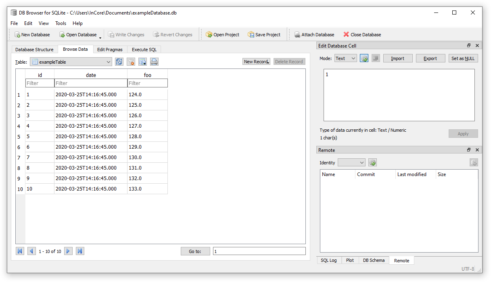

Measurements Database Tutorial
==============================

In this tutorial we want to explore how to store measurements in a database. The :ref:`module_Database` module provides all database-related objects. We start by storing the measurements in a local SQLite database on the device:

.. code-block:: qml

    import InCore.Foundation 2.0
    import InCore.Database 2.0

    Application {
        name: "DatabaseTest"
        LocalDatabase {
            id: exampleDatabase
        }
    }

This application creates an empty database in the file :file:`/storage/incore/DatabaseTest/exampleDatabase.db`. As you can see both the application name and the object ID of the database (either by assigning an ID or setting the :ref:`Object.objectId <property_Object_objectId>` property) are crucial since they are used to construct the filename. So never forget to assign an application name and the database object ID and use sensible names.

Next we want to define a database table which can be accomplished easily using :ref:`object_DatabaseTable`:

.. code-block:: qml

    import InCore.Foundation 2.0
    import InCore.Database 2.0

    Application {
        name: "DatabaseTest"
        LocalDatabase {
            id: exampleDatabase
            DatabaseTable {
                id: exampleTable
            }
        }
        onCompleted: {
            exampleTable.open()
        }
    }

When running this version a database table called ``exampleTable`` is created which you'll likely want to inspect to verify everything went fine. For this purpose copy the database file :file:`/storage/incore/DatabaseTest/exampleDatabase.db` to your local computer as described in section :ref:`AccessingAppData` in the :ref:`DevelopmentManual`. Now open the file using the `SQLite Database Browser <https://sqlitebrowser.org/>`_ and examine the structure of the example table like shown in :numref:`SqliteBrowserIdOnly`.

.. _SqliteBrowserIdOnly:

    Empty example table in SQLite Database Browser

So far the table consist of an internal ``id`` column only, representing the primary key for this table. The next task is to add columns with actual data to the database table. Any object derived from the :ref:`object_DataObject` object can be used as a database table column (to be more precise: every :ref:`object_DataObjectWriter`-based object works with a list of :ref:`object_DataObject`-based :ref:`objects <property_DataObjectWriter_objects>`). This means we can add a :ref:`object_Measurement` object and a :ref:`object_DateTime` object:

.. code-block:: qml

    import InCore.Foundation 2.0
    import InCore.Database 2.0

    Application {
        name: "DatabaseTest"
        LocalDatabase {
            id: exampleDatabase
            DatabaseTable {
                id: exampleTable
                DateTime { id: date }
                Measurement { id: foo; data: 123 }
            }
        }
        onCompleted: {
            exampleTable.drop()
            exampleTable.open()
        }
    }

.. note:: Perhaps you have noticed the additional call of the :ref:`DatabaseTable.drop() <method_DatabaseTable_drop>` method in this version. It's required in this case since the table already exists after running the previous version but it has a different structure now. Alternatively you can remove the whole database file manually using WinSCP or by issueing ``rm /storage/incore/DatabaseTest/exampleDatabase.db`` in a PuTTY session.

Examine the resulting database file again using SQLite Database Browser and observe the additional columns in ``exampleTable``. Now it's time to actually insert some data rows. Extend the application as following:

.. code-block:: qml

    import InCore.Foundation 2.0
    import InCore.Database 2.0

    Application {
        name: "DatabaseTest"
        LocalDatabase {
            id: exampleDatabase
            DatabaseTable {
                id: exampleTable
                DateTime { id: date }
                Measurement { id: foo; data: 123 }
            }
        }
        onCompleted: {
            exampleTable.drop()
            for(let i = 0; i < 10; ++i)
            {
                foo.data++
                exampleTable.submit()
            }
        }
    }

The resulting data in the table will look like shown in :numref:`SqliteBrowserExampleData`.

.. _SqliteBrowserExampleData:

    Example data in SQLite Database Browser

This still is a rather artificial example with way too much non-declarative code. Therefore let's incorporate what we've learned in the :ref:`AnalogDigitalIOTutorial` and put everything together into a sensible application:

.. code-block:: qml

    import InCore.Foundation 2.0
    import InCore.Database 2.0
    import InCore.IO 2.0

    Application {
        name: "DatabaseTest"

        AnalogInput {
            id: ain1
            index: AnalogInput.AIN1
            mode: AnalogInput.Mode20mA
            Polling on value { }
        }

        LocalDatabase {
            id: exampleDatabase

            DatabaseTable {
                id: exampleTable

                submitMode: DatabaseTable.SubmitPeriodically
                submitInterval: 2000

                DateTime { id: date }
                Measurement { id: foo; data: ain1.value }

                onErrorOccurred: drop()
            }
        }
    }

What has changed compared to the previous example? First we added an analog input which is polled every second. Then two properties related to dataset submissions are customized to make the database table submit a new row every 2 seconds automatically. This way we don't have to call :ref:`DatabaseTable.submit() <method_DataObjectWriter_submit>` manually using a :ref:`object_Timer` object. Last but not least the database table is no longer dropped on every application start but in case of an error only, e.g. due to a mismatching table structure.

Congratulations, you just created an application which records real-world data into a database! Now take a look at the :ref:`DatabaseExporter example <example_DatabaseExporter>` and try to make the application above export the recorded data as a CSV file on a USB drive. Sounds complicated but it takes less than 15 additional lines of code, promised!

.. tip:: Did you know you can exchange the database type easily? Simply change ``LocalDatabase`` to ``MySQLDatabase`` or ``MSSQLDatabase`` and add a few connection-related properties such as :ref:`Database.name <property_Database_name>`, :ref:`NetworkDatabase.server <property_NetworkDatabase_server>`, :ref:`NetworkDatabase.user <property_NetworkDatabase_user>` and :ref:`NetworkDatabase.password <property_NetworkDatabase_password>`. Afterwards all measurements will be submitted to the specified remote database server.
