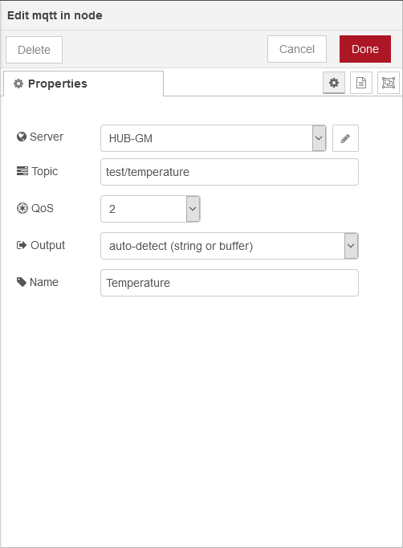
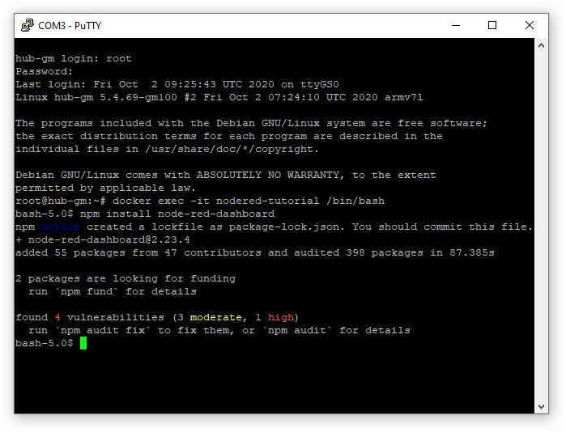

Node-RED Tutorial
=================

This tutorial will guide you through the installation of `Node-RED <https://nodered.org/>`_ on HUB-GM devices and explains how it can be integrated with InCore applications.

Node-RED is a programming tool for wiring together hardware devices, APIs and online services in new and interesting ways. It provides a browser-based editor that makes it easy to wire together flows using the wide range of nodes in the palette that can be deployed to its runtime in a single-click. [1]_

Installation
------------

For maximum flexibility Node-RED is not bundled with SIINEOS but can be installed (and updated) easily as a Docker container. First we start the Docker service and pull the Node-RED image at the command line after logging in as ``root``:

.. code-block:: none

    systemctl start docker
    docker pull nodered/node-red:latest-minimal

Using the command line allows monitoring the download and installation progress and checking for potential errors (such as device not being connected to the Internet).

    Installing the Node-RED Docker container
  
You can however also skip the previous step and let the :ref:`DockerService QML object <object_DockerService>` do the work for you as shown in the next step (in this case the first application start will take a few more additional minutes).

Next we have to create a Docker container definition in QML:

.. code-block:: qml

    import InCore.Foundation 2.2

    Application {
        System {
            DockerService {
                DockerContainer {
                    name: "nodered-tutorial"
                    image: "nodered/node-red:latest-minimal"
                    ports: [ "80:1880" ]
                }
            }
        }
    }

This application will start a Docker container named ``nodered-tutorial`` with the ``nodered/node-red:latest-minimal`` image. The Node-RED web server runs on port ``1880`` per default. It therefore needs to be forwarded ("exposed") from the container to port ``80`` on the host system using the :ref:`ports property <property_DockerContainer_ports>`. After starting this application, the web interface can be accessed at `http://192.168.123.1 <http://192.168.123.1>`_. Since Node-RED performs initial setup tasks at start, it will take about 1 minute until the web interface is available.

    Default view after starting new Node-RED instance

.. note:: In this tutorial, we use the ``latest-minimal`` image variation. If you need a different version with more components included (e.g. Python), see `Node-RED Docker Image Variations <https://github.com/node-red/node-red-docker/blob/master/README.md#image-variations>`_ for other possible tag names.

You can start playing with Node-RED and create new flows as you like. You'll soon notice that all changes will be lost after restarting the container or the whole device. This is because no data volume has yet been created and defined for the container so all changes made by Node-RED are discarded when the container is stopped. However, this shortcoming can easily be remedied by adding only one line to our container definition:

.. code-block:: qml

    import InCore.Foundation 2.2

    Application {
        System {
            DockerService {
                DockerContainer {
                    name: "nodered-tutorial"
                    image: "nodered/node-red:latest-minimal"
                    ports: [ "80:1880" ]
                    volumes: [ DockerVolume { name: "node_red_data"; destination: "/data" } ]
                }
            }
        }
    }

With this version all changes will be persistent and stored on the device's storage partition. Subsequent Node-RED container starts will also be much faster since Node-RED can skip its internal setup tasks, i.e. the web interface can be accessed more quickly.

.. tip:: Resetting the Node-RED instance to factory defaults is very easy. After stopping and removing the container (``docker rm -f nodered-tutorial``), you can simply remove the data volume by running ``docker volume rm -f node_red_data`` at the command line.

Integration
-----------

Next it's time to make Node-RED talk to our InCore application. The preferred mechanism for communication between InCore applications and Docker containers in general is :ref:`MQTT <module_mqtt>`. Thanks to the InCore MQTT module, it's very simple to start an MQTT broker and publish topics with some device-related measurements:

.. code-block:: qml

    import InCore.Foundation 2.2
    import InCore.Mqtt 2.2

    Application {

        System {
            id: system
            Polling on deviceTemperature { }
            Polling on deviceHumidity { }
            Polling on cpuLoad { }

            DockerService {
                DockerContainer {
                    name: "nodered-tutorial"
                    image: "nodered/node-red:latest-minimal"
                    ports: [ "80:1880" ]
                    volumes: [ DockerVolume { name: "node_red_data"; destination: "/data" } ]
                }
            }
        }

        MqttBroker { internal: false }

        MqttClient {
            hostname: "127.0.0.1"

            MqttPublication {
                MqttTopic { name: "test/temperature"; data: system.deviceTemperature }
                MqttTopic { name: "test/humidity"; data: system.deviceHumidity }
                MqttTopic { name: "test/cpuload"; data: system.cpuLoad }
            }
        }
    }

Once the application has been started, it's ready for incoming connections. Now switch back to the Node-RED window, filter for :guilabel:`mqtt` nodes on the lft, drag the :guilabel:`mqtt in` node to the flow and double click the newly created node:

    Adding an :guilabel:`mqtt in` node to the flow

First our MQTT broker needs to be added by clicking the edit button next to the :guilabel:`Server` field. Enter a name at your will and set ``192.168.123.1`` as the server address:

    Adding the local MQTT broker
 
After clicking :guilabel:`Add`, you'll be back to the :guilabel:`Edit mqtt in node` view. Specify the topic name to subscribe according to the name in our application (``test/temperature``) and optionally set the node name at the bottom:

    Setting properties of the MQTT node

Finish by clicking :guilabel:`Done` and :guilabel:`Deploy` at the top right. If everything went well, you'll see the :guilabel:`Temperature` node being connected:

    MQTT node in Node-RED connected to InCore application

The actual value can be displayed easily by adding a :guilabel:`debug` node, connecting it to the :guilabel:`Temperature` node, deploying the flow and navigating to the :guilabel:`Debug messages` view:

    Debugging the value of a subscribed MQTT topic

Creating dashboards
-------------------

The next challenge is to implement a simple dashboard which displays our measurements in an appealing web interface. Since the default Node-RED container comes with no additional modules, we first have to install the ``node-red-dashboard`` module. For doing so, open the menu through the menu button on the top left and click :guilabel:`Manage palette`. Next switch to the :guilabel:`Install` tab, search for ``node-red-dashboard`` and click on the :guilabel:`Install` button:

    Installing the Node-RED Dashboard module

After the installation has finished, you can close the management view. You'll find a new node section :guilabel:`dashboard` with all related nodes on the left (scroll down). Now we can replace the :guilabel:`debug` node with a :guilabel:`gauge` node and connect it to the :guilabel:`Temperature` node.

Before the gauge can be displayed, the user interface needs to be configured. Double click the :guilabel:`gauge` node which opens the :guilabel:`Edit gauge node` dialog:

    Editing the first gauge for the Node-RED dashboard

Now click the edit button next to the :guilabel:`Group` field. This opens a second dialog :guilabel:`Add new dashboard group config node` which allows you adding a user interface group. If desired, you can change the :guilabel:`Name`.

    Adding the default user interface group to the Node-RED dashboard

Additionally the group needs to be assigned to a tab. For this purpose click on the edit button next to the :guilabel:`Tab` field which opens another dialog :guilabel:`Add new dashboard tab config node`:

    Adding the home tab to the Node-RED dashboard

For the time being, leave all values at their defaults and click on :guilabel:`Add` on the top. Back to the :guilabel:`Add new dashboard group config node` dialog, click on :guilabel:`Add` again. Now we can start customizing our gauge, e.g. by changing the name, value format (display 2 decimals only), units, value range and name:

    Customizing the first gauge for the Node-RED dashboard

Finally click the :guilabel:`Done` button on the top and deploy the flow. The dashboard with a temperature gauge is now available at `http://192.168.123.1/ui/ <http://192.168.123.1/ui/>`_:

    A first simple but fully functional Node-RED dashboard

As a last exercise try adding gauges for the other two topics (``test/humidity`` and ``test/cpuload``) as well as a chart for temperature and humidity. The flow and the resulting dashboard could look like:

    Flow for an advanced Node-RED dashboard

    User interface of an advanced Node-RED dashboard

.. seealso:: Please refer to the `node-red-dashboard documentation <https://flows.nodered.org/node/node-red-dashboard>`_ for further details on how to use this module and its nodes.

Advanced administration
-----------------------

To perform administrative tasks such as installing additional Node-RED modules or NPM packages, a shell within a running Node-RED Docker container can be started from the command line:

.. code-block:: none

    docker exec -it nodered-tutorial /bin/bash

From this shell we can e.g. install the ``node-red-dashboard`` module:

.. code-block:: none

    npm install node-red-dashboard

    Installing the ``node-red-dashboard`` module through the command line

Further information on how to use the command line to manage Node-RED in a Docker container can be found in the `Node-RED online documentation <https://nodered.org/docs/getting-started/docker>`_.

.. [1] `Node-RED homepage <https://nodered.org/>`_

